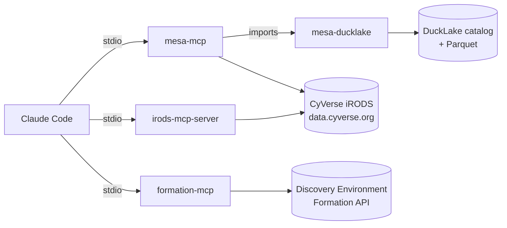

# MESA

**MESA** wires the CyVerse data-management MCP servers into
[Claude Code](https://docs.claude.com/en/docs/claude-code/overview) with a single
command. One installer clones, builds, and registers everything you need to browse and
curate the CyVerse Data Store (iRODS), apply ontology-backed metadata, and launch
Discovery Environment apps — all from natural language.

## Install

```bash
curl -fsSL https://raw.githubusercontent.com/idss-mesa/mesa/main/install.sh | bash
```

Runs on **Linux, macOS, and Windows Subsystem for Linux (WSL)**. By default it uses
anonymous public CyVerse access — no credentials required to get started.

[Get started :material-arrow-right:](quickstart.md){ .md-button .md-button--primary }
[Install reference](install.md){ .md-button }

## What gets installed

| Server | Language | What it does |
|---|---|---|
| [**mesa-mcp**](servers/mesa-mcp.md) | Python | iRODS Data Store (`ds_*`) + OBO/OLS ontology AVUs (`mesa_ols_*`, `mesa_avu_*`) + DataCite + DuckLake metadata history |
| [**mesa-ducklake**](servers/mesa-ducklake.md) | Python | AVU metadata-history library that backs mesa-mcp (installed alongside it — not a standalone server) |
| [**irods-mcp-server**](servers/irods-mcp-server.md) | Go | Reference iRODS Data Store MCP server |
| [**formation-mcp**](servers/formation-mcp.md) | Go | CyVerse Discovery Environment — launch apps, manage analyses |

After install, the three servers (`mesa-mcp`, `irods`, `formation`) appear in
`claude mcp list`. Open Claude Code and ask it to *"ping the CyVerse Data Store"* to
confirm the link.

## How it fits together



Source repositories live in the [**idss-mesa**](https://github.com/idss-mesa) GitHub
organization.
