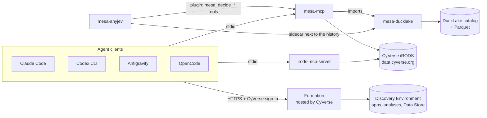

<!-- OKF deviation: OKF v0.2 (§8, §12) reserves the bundle-root index.md as a
     directory listing whose only frontmatter is okf_version. Zensical requires
     index.md to be the site homepage, so this file also keeps title, description
     and icon (consumers tolerate unknown keys, §11) and a rich homepage body.
     See README "Docs conventions". -->

# MESA

**MESA** (Multidisciplinary Environment for Scientific Advancement) connects you to
CyVerse data and computing three ways:

- the **[MESA Portal](portal/index.md)** at <https://mesa.cyverse.org>, a web site for
  your CyVerse Data Store files, apps, and analyses;
- the **[featured apps](apps/index.md)** — JupyterLab, RStudio, VS Code, a terminal, and a
  Linux desktop in the cloud, each with AI coding agents already set up;
- the **MESA MCP stack**, which wires the CyVerse data-management MCP servers — two local
  ones and CyVerse's hosted [Formation](servers/formation-mcp.md) — into your AI
  coding agent — [Claude Code](claude-code.md), [Codex CLI](codex.md),
  [Antigravity](antigravity.md), or [OpenCode](opencode.md) — with a single command, so
  you can browse and curate the CyVerse Data Store (iRODS), apply ontology-backed
  metadata, and launch Discovery Environment apps from natural language.

## MESA Portal

Sign in at <https://mesa.cyverse.org> with your CyVerse account (free at
<https://user.cyverse.org>). Nothing to install.


| I want to… | Guide |
|---|---|
| Find my way around and sign in | [Overview](portal/overview.md) |
| Browse, upload, share, and describe my files | [Managing data](portal/data.md) |
| Start JupyterLab, RStudio, VS Code, or another app | [Starting applications](portal/applications.md) |
| Get back to a running app, extend it, stop it, find its results | [Managing analyses](portal/analyses.md) |

[Open the MESA Portal :material-arrow-right:](https://mesa.cyverse.org){ .md-button .md-button--primary }
[Portal guide](portal/overview.md){ .md-button }

## Featured apps

Each featured app runs on CyVerse VICE with your Data Store mounted, the AI coding-agent
CLIs installed, and the MESA MCP servers registered. Each also has a GPU build with CUDA
PyTorch and a local [Ollama](https://ollama.com) server.

| App | What it is |
|---|---|
| [**MESA CLI**](apps/cli.md) (*MESA Cloud Shell*) | A terminal in the browser, with Claude Code, Codex, OpenCode, Goose, and Antigravity |
| [**MESA JupyterLab**](apps/jupyterlab.md) | Python, R, and Julia notebooks, with RStudio and VS Code in the Launcher |
| [**MESA RStudio Geospatial**](apps/rstudio.md) | RStudio on the Rocker geospatial stack (sf, terra, stars, GDAL) |
| [**MESA VS Code**](apps/vscode.md) | VS Code in the browser, with Cline wired to the MESA MCP servers |
| [**MESA KASM Ubuntu Desktop**](apps/kasm.md) | A full Ubuntu desktop in the browser |

See [AI agents in the MESA apps](apps/agents.md) for signing in to CyVerse and connecting
AI Verde or local models inside any of them.

## Install the MCP stack

```bash
curl -fsSL https://raw.githubusercontent.com/idss-mesa/docs/main/install.sh | bash
```

Runs on **Linux, macOS, and Windows Subsystem for Linux (WSL)**. The Data Store servers use
anonymous public CyVerse access by default — no credentials required to get started — and
the hosted Discovery Environment server asks you to sign in with your CyVerse account once
in each client.

[Get started :material-arrow-right:](quickstart.md){ .md-button .md-button--primary }
[Install reference](install.md){ .md-button }

## What gets installed

| Server | Language | What it does |
|---|---|---|
| [**mesa-mcp**](servers/mesa-mcp.md) | Python | iRODS Data Store (`ds_*`) + OBO/OLS ontology AVUs (`mesa_ols_*`, `mesa_avu_*`) + DataCite + DuckLake metadata history |
| [**mesa-ducklake**](servers/mesa-ducklake.md) | Python | AVU metadata-history library that backs mesa-mcp (installed alongside it — not a standalone server) |
| [**mesa-anyjev**](servers/mesa-anyjev.md) | Python | Calibrated ontology and schema decisions; a plugin that adds the `mesa_decide_*` tools to mesa-mcp (installed alongside it) |
| [**irods-mcp-server**](servers/irods-mcp-server.md) | Go | Reference iRODS Data Store MCP server |
| [**Formation**](servers/formation-mcp.md) | hosted by CyVerse | CyVerse Discovery Environment — launch apps, manage analyses, read and write Data Store files. Nothing to build: registered by URL, <https://de.cyverse.org/formation/mcp> |

After install, the three servers (`mesa-mcp`, `irods`, `formation`) are registered with
every client the installer detected; sign in to `formation` with your CyVerse account
once in each client. Formation also works on its own as a
[custom connector on claude.ai and in Claude Desktop](claude-ai.md). Open your agent and ask it to *"ping the CyVerse
Data Store"* to confirm the link — see the [Quickstart](quickstart.md) for per-client
verification.

## How it fits together


```mermaid
graph LR
  subgraph clients [Agent clients]
    CC[Claude Code]
    CX[Codex CLI]
    AG[Antigravity]
    OC[OpenCode]
  end
  clients -->|stdio| M[mesa-mcp]
  clients -->|stdio| I[irods-mcp-server]
  clients -->|HTTPS + CyVerse sign-in| F[Formation<br/>hosted by CyVerse]
  M -->|imports| D[mesa-ducklake]
  A[mesa-anyjev] -->|plugin: mesa_decide_* tools| M
  A -->|sidecar next to the history| D
  M --> IR[(CyVerse iRODS<br/>data.cyverse.org)]
  I --> IR
  F --> DE[(Discovery Environment<br/>apps, analyses, Data Store)]
  D --> PQ[(DuckLake catalog<br/>+ Parquet)]
```

Source repositories live in the [**idss-mesa**](https://github.com/idss-mesa) GitHub
organization.

## For AI agents

This site is an [Open Knowledge Format (OKF) v0.2](https://github.com/GoogleCloudPlatform/knowledge-catalog/blob/main/okf/SPEC.md)
knowledge bundle: every page carries YAML frontmatter with its type, provenance, and
lifecycle. Three addresses return the same content for any page — the rendered page, its
Markdown twin (add `index.md` to the page address, or use the **View this page as
Markdown** button in the upper right), and the raw source on GitHub:

| What | Address |
|---|---|
| Outline of every page | [`https://idss-mesa.github.io/docs/llms.txt`](https://idss-mesa.github.io/docs/llms.txt) |
| Whole corpus in one file | [`https://idss-mesa.github.io/docs/llms-full.txt`](https://idss-mesa.github.io/docs/llms-full.txt) |
| Markdown twin of a page | [`https://idss-mesa.github.io/docs/quickstart/index.md`](https://idss-mesa.github.io/docs/quickstart/index.md) |
| Raw source on GitHub | [`https://raw.githubusercontent.com/idss-mesa/docs/main/docs/quickstart.md`](https://raw.githubusercontent.com/idss-mesa/docs/main/docs/quickstart.md) |

See [For AI agents](about/ai-agents.md) for the entry points, trust signals, and what to
do if your harness cannot reach this site. For CyVerse *data*, install the MESA servers
and call their tools rather than reading these pages.
