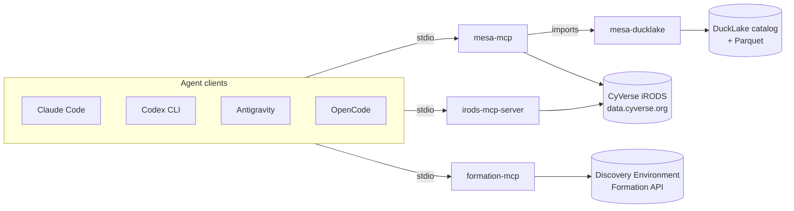

<!-- OKF deviation: OKF v0.2 (§8, §12) reserves the bundle-root index.md as a
     directory listing whose only frontmatter is okf_version. Zensical requires
     index.md to be the site homepage, so this file also keeps title, description
     and icon (consumers tolerate unknown keys, §11) and a rich homepage body.
     See README "Docs conventions". -->

# MESA

**MESA** wires the CyVerse data-management MCP servers into your AI coding agent —
[Claude Code](claude-code.md), [Codex CLI](codex.md), [Antigravity](antigravity.md), or
[OpenCode](opencode.md) — with a single command. One installer clones, builds, and
registers everything you need to browse and curate the CyVerse Data Store (iRODS), apply
ontology-backed metadata, and launch Discovery Environment apps — all from natural
language.

## Install

```bash
curl -fsSL https://raw.githubusercontent.com/idss-mesa/docs/main/install.sh | bash
```

Runs on **Linux, macOS, and Windows Subsystem for Linux (WSL)**. By default it uses
anonymous public CyVerse access — no credentials required to get started.

[Get started :material-arrow-right:](quickstart.md){ .md-button .md-button--primary }
[Install reference](install.md){ .md-button }

## What gets installed

| Server | Language | What it does |
|---|---|---|
| [**mesa-mcp**](servers/mesa-mcp.md) | Python | iRODS Data Store (`ds_*`) + OBO/OLS ontology AVUs (`mesa_ols_*`, `mesa_avu_*`) + DataCite + DuckLake metadata history |
| [**mesa-ducklake**](servers/mesa-ducklake.md) | Python | AVU metadata-history library that backs mesa-mcp (installed alongside it — not a standalone server) |
| [**irods-mcp-server**](servers/irods-mcp-server.md) | Go | Reference iRODS Data Store MCP server |
| [**formation-mcp**](servers/formation-mcp.md) | Go | CyVerse Discovery Environment — launch apps, manage analyses |

After install, the three servers (`mesa-mcp`, `irods`, `formation`) are registered with
every client the installer detected. Open your agent and ask it to *"ping the CyVerse
Data Store"* to confirm the link — see the [Quickstart](quickstart.md) for per-client
verification.

## How it fits together


```mermaid
graph LR
  subgraph clients [Agent clients]
    CC[Claude Code]
    CX[Codex CLI]
    AG[Antigravity]
    OC[OpenCode]
  end
  clients -->|stdio| M[mesa-mcp]
  clients -->|stdio| I[irods-mcp-server]
  clients -->|stdio| F[formation-mcp]
  M -->|imports| D[mesa-ducklake]
  M --> IR[(CyVerse iRODS<br/>data.cyverse.org)]
  I --> IR
  F --> DE[(Discovery Environment<br/>Formation API)]
  D --> PQ[(DuckLake catalog<br/>+ Parquet)]
```

Source repositories live in the [**idss-mesa**](https://github.com/idss-mesa) GitHub
organization.

## For AI agents

This site is an [Open Knowledge Format (OKF) v0.2](https://github.com/GoogleCloudPlatform/knowledge-catalog/blob/main/okf/SPEC.md)
knowledge bundle: every page carries YAML frontmatter with its type, provenance, and
lifecycle, every page's Markdown is served at its URL plus `index.md`, and the whole
corpus is available as [`llms.txt`](llms.txt) and [`llms-full.txt`](llms-full.txt). See
[For AI agents](about/ai-agents.md) for the entry points and trust signals.
