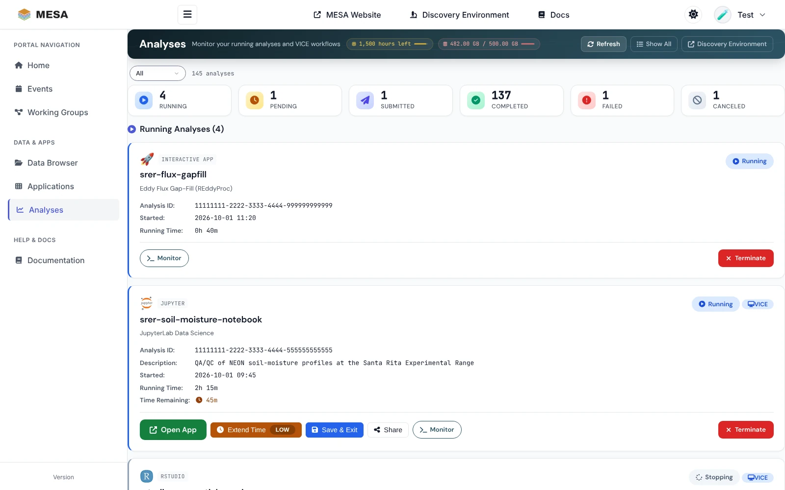
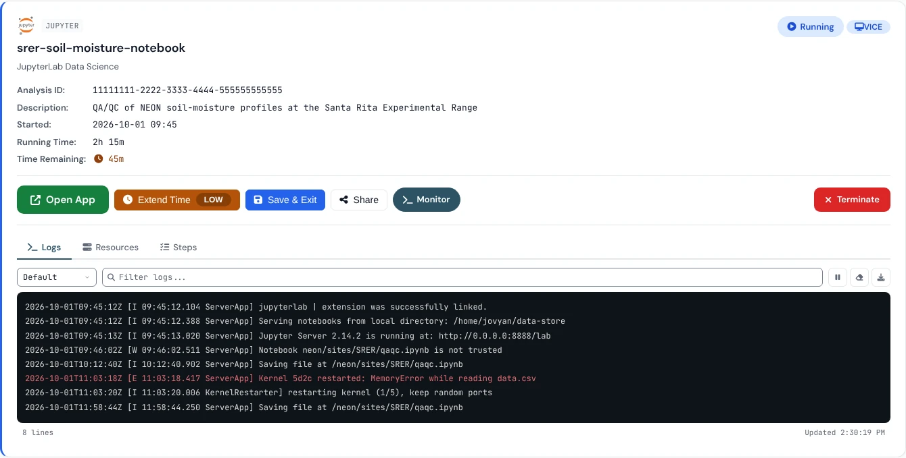
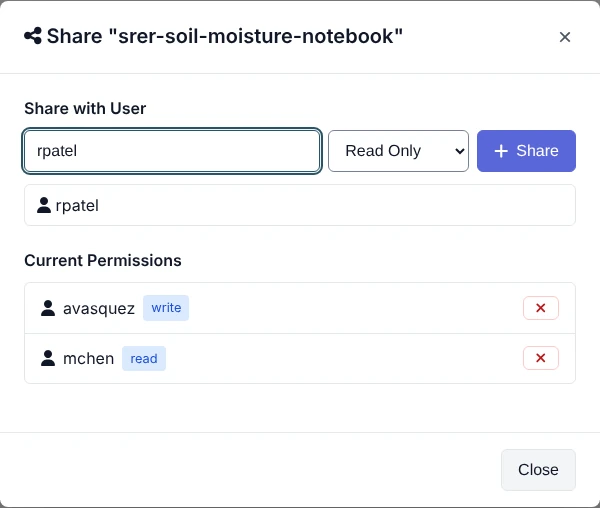
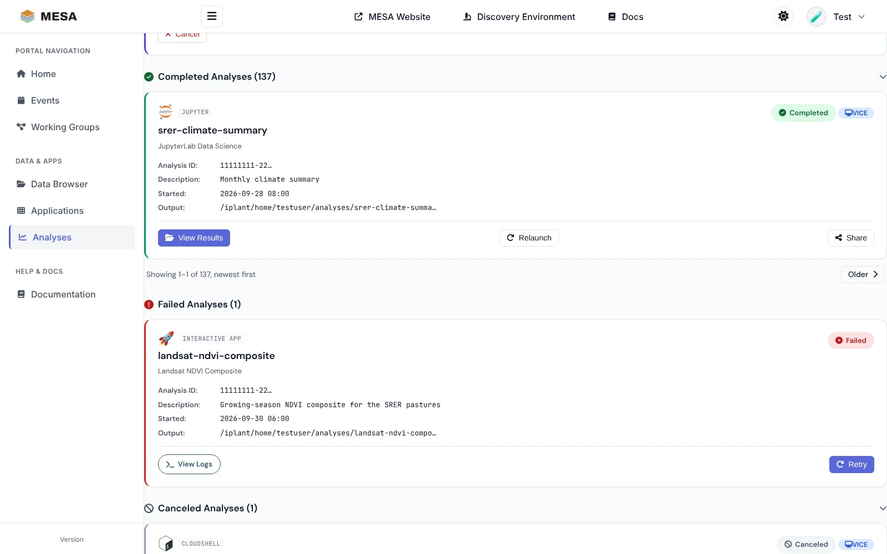

# Managing analyses

Every app you run on CyVerse becomes an **analysis**: an interactive session such as a
JupyterLab notebook, or a batch job. The **Analyses** page
(<https://mesa.cyverse.org/analyses/>) lists them all, whether you started them in the
portal, in the Discovery Environment, or from an AI agent through CyVerse's hosted
[Formation](../servers/formation-mcp.md) server (in any MCP client, including a claude.ai
connector)[^portal].

## Read the page

- The **header** shows the CPU hours you have left and your Data Store use against your
  quota, plus **Refresh**, **Show All**, and a link to the **Discovery Environment**.
- The **status cards** count your analyses by status: **Running**, **Pending**,
  **Submitted**, **Completed**, **Failed**, and **Canceled**. Click a card, or use the menu
  above them, to show only that status. A count such as `100+` means CyVerse did not
  report an exact total.
- Below, each status has its own list, newest first. Each card shows the analysis name,
  the app, the analysis ID, its description, when it started, how long it has run, and,
  for interactive apps, the **time remaining**. A **VICE** badge marks interactive apps.
- Each list shows up to 100 analyses. Longer lists of completed, failed, or canceled
  analyses have **Newer** and **Older** links.

## Statuses and actions

| Status | Meaning | Actions |
|---|---|---|
| **Submitted** | CyVerse received the request | **Cancel** |
| **Pending** | Waiting for compute resources | **Cancel** |
| **Running** | The app is running | **Open App**, **Extend Time**, **Save & Exit**, **Share**, **Monitor**, **Terminate** |
| **Stopping…** | You asked it to stop; CyVerse is shutting it down (10–30 seconds) | None; the page updates by itself |
| **Completed** | Finished | **View Results**, **Relaunch**, **Share** |
| **Failed** | Ended with an error | **View Logs**, **Retry** |
| **Canceled** | Stopped before it finished | **Relaunch** |

## Work with a running app

- **Open App** opens the running app in a new tab. This is how you get back to a
  JupyterLab, RStudio, VS Code, terminal, or desktop session you started earlier.
- **Monitor** opens a panel under the card with three tabs: **Logs** (the app's output,
  with a filter box, pause, and download), **Resources** (the CPU, memory, and other
  resources of the analysis), and **Steps** (its execution steps and their status).
- **Share** lets other CyVerse users see the analysis (read only or with write access).

{ width="520" }

### Keep an eye on the time limit

Interactive apps have a time limit. **Time Remaining** turns yellow with an hour or less
left and red with 30 minutes or less, and the **Extend Time** button shows **LOW**. Click
**Extend Time** to add time before it runs out. When the limit is reached, the app stops.

### Stop an app

- **Save & Exit** saves the app's outputs to your Data Store and then ends it; it shows as
  **Completed**.
- **Terminate** ends it at once; it shows as **Canceled**. Anything not saved in your Data
  Store is lost.

After either, the card reads **Stopping…** until CyVerse confirms; you do not need to
click again. Before you stop an app, save your notebooks and files under `~/data-store`,
and commit and push code you want to keep.

Stopping apps you no longer use frees CPU hours on your quota.

## Find the results

- **View Results** on a completed analysis opens its output folder in the
  [Data Browser](data.md). Unless you chose another folder, results are under
  `/iplant/home/<username>/analyses/`.
- **Relaunch** starts the app again with the same settings, which you can change first.
- On a failed analysis, **View Logs** shows what went wrong (look for errors such as
  "out of memory" or a missing file); **Retry** runs it again.

## Troubleshooting

| Problem | What to do |
|---|---|
| Stuck in **Pending** | CyVerse is waiting for resources. Wait, or cancel and launch with fewer CPU cores, less memory, or no GPU. If it lasts more than 30 minutes, contact support. |
| **Open App** does nothing | Wait for **Running**, allow pop-ups for mesa.cyverse.org, and try again. |
| "Your CyVerse session has ended" | Click **Sign in again**, then retry. A stop you already sent still goes ahead. |
| The app stopped unexpectedly | Check whether the time limit ran out, and look in **Monitor → Logs** for memory errors. |
| No **Extend Time** button | It is offered only for running interactive apps, and not while the app is still starting. |
| Results are missing | Make sure the analysis completed, then refresh the Data Browser; a job may still be writing files. |

[^portal]: MESA Portal Analyses page, <https://mesa.cyverse.org/analyses/>; MESA Portal Analyses user guide, <https://mesa.cyverse.org/docs/>.
