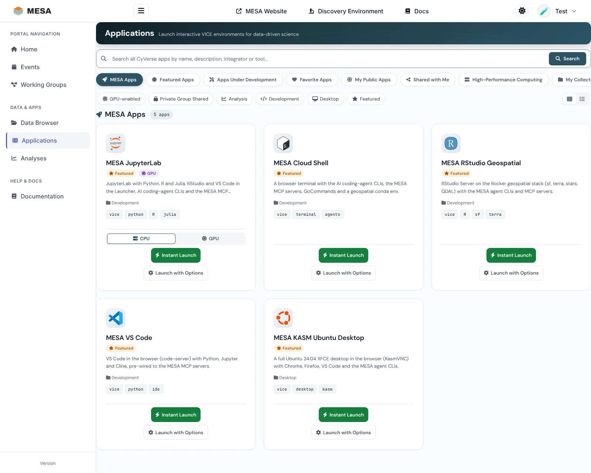
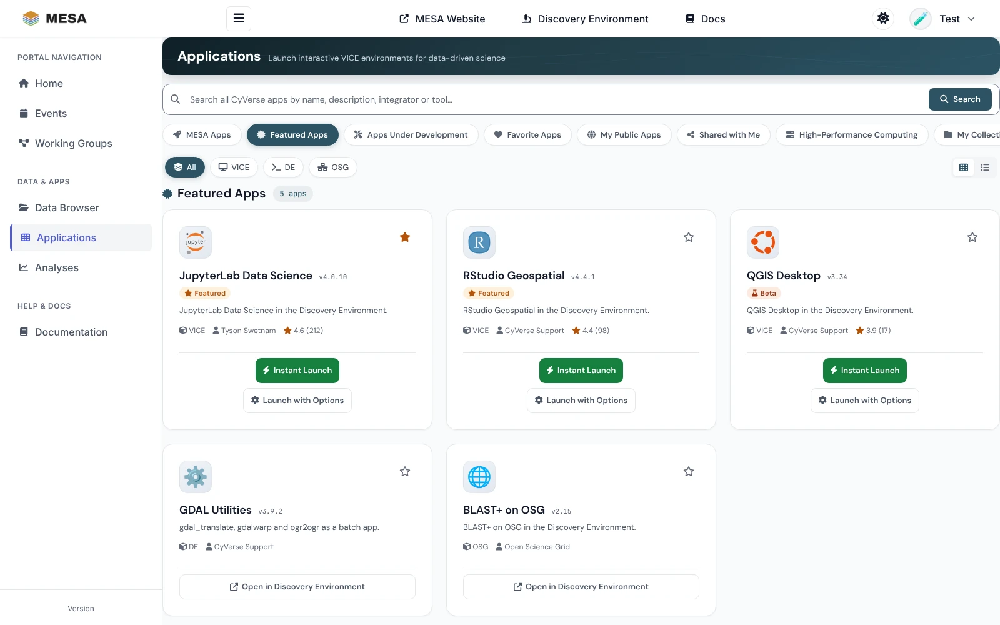
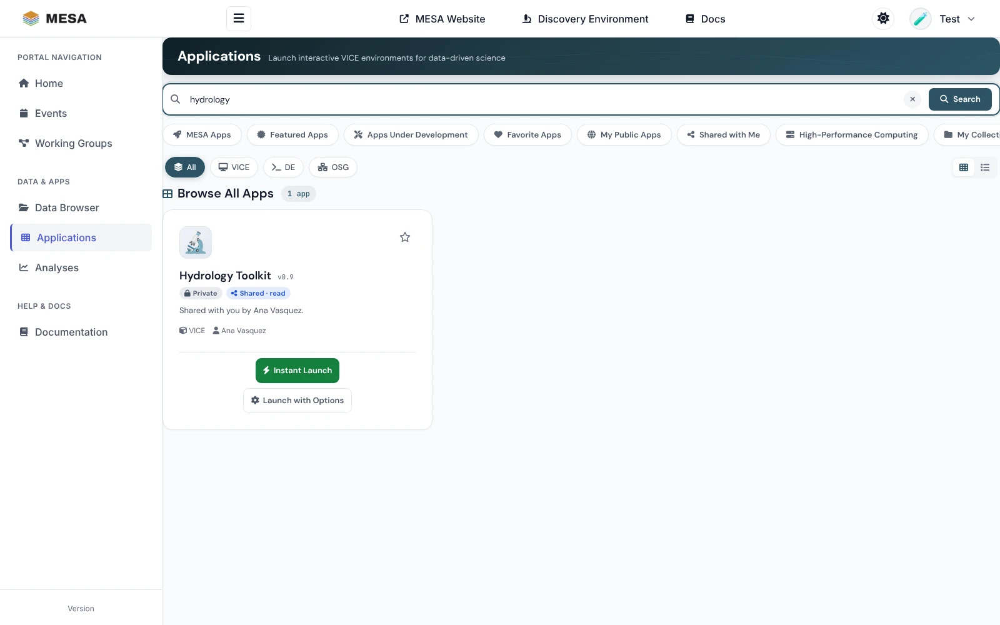
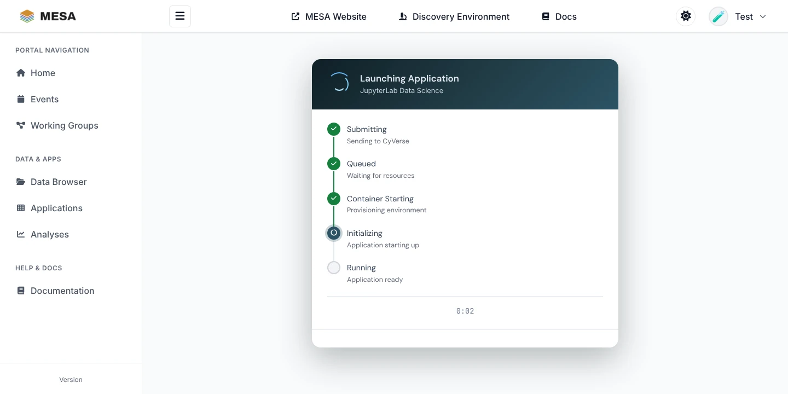
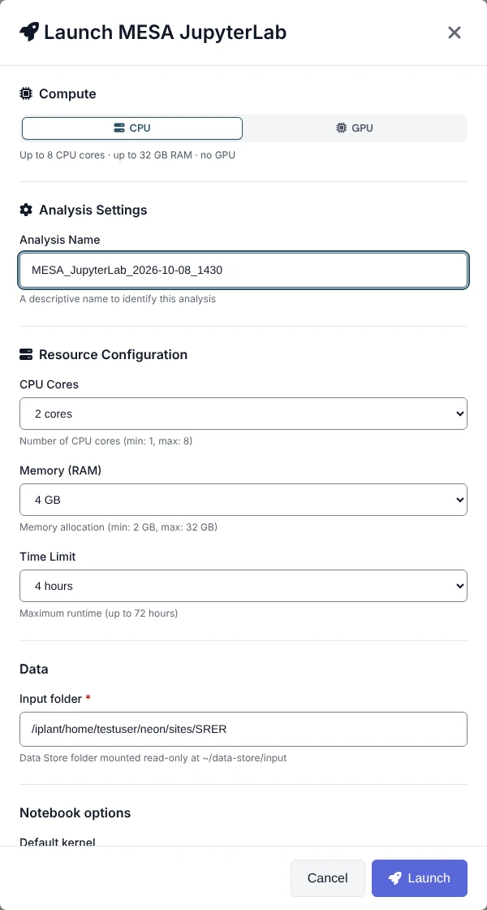
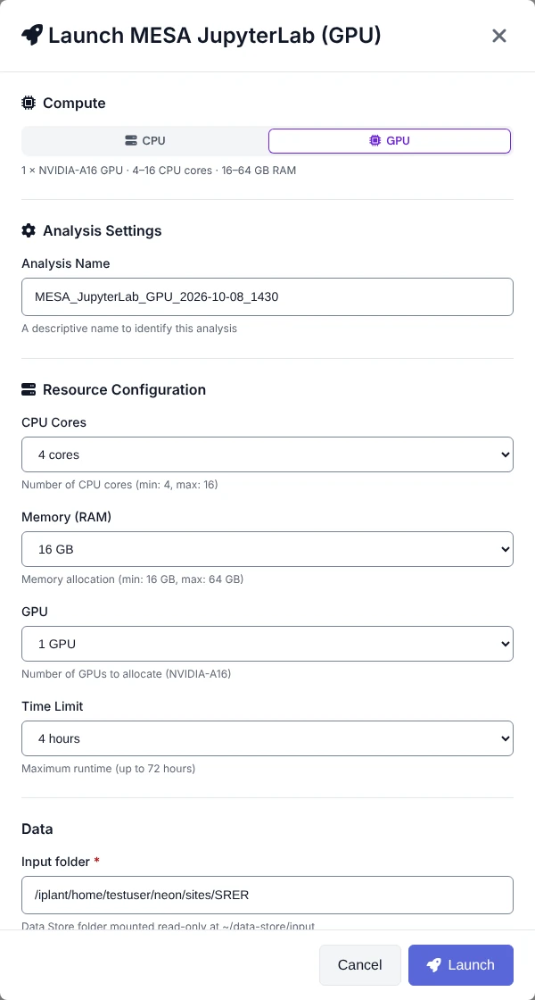

# Starting applications

The **Applications** page (<https://mesa.cyverse.org/applications/>) is a catalog of
everything you can run on CyVerse: the MESA [featured apps](../apps/index.md) and the
whole Discovery Environment (DE) catalog[^portal]. Interactive apps (*VICE* apps such as
JupyterLab, RStudio, VS Code, a terminal, or a Linux desktop) start from the portal and
open in a new browser tab; batch apps open in the Discovery Environment.

## Quick start

1. Click **Applications** in the sidebar. The **MESA Apps** tab opens.
2. On the app you want, click **Instant Launch**.
3. A new tab shows the launch progress and opens the app when it is ready, usually within
   one to three minutes.
4. Later, return to the app from the [Analyses](analyses.md) page with **Open App**.

You must be signed in to launch. Signed out, the cards show **Sign in to launch**.

## Find an app

### Sections

The tabs above the catalog mirror the sections of the DE apps page:

| Tab | What it shows | Sign-in needed |
|---|---|---|
| **MESA Apps** | The apps curated for MESA: the [featured apps](../apps/index.md) and any group apps you have access to | No (group apps: yes) |
| **Featured Apps** | CyVerse's own featured apps | No |
| **Apps Under Development** | Apps you created in the DE and have not published | Yes |
| **Favorite Apps** | Apps you starred | Yes |
| **My Public Apps** | Apps you published | Yes |
| **Shared with Me** | Apps other CyVerse users shared with you | Yes |
| **High-Performance Computing** | HPC apps that run on Tapis systems (needs a one-time Tapis authorization) | Yes |
| **My Collections** | App collections of the CyVerse communities you belong to | Yes |
| **Browse All Apps** | The complete CyVerse catalog; search results appear here | No |

The address bar follows the tab, so you can bookmark a section: for example
`https://mesa.cyverse.org/applications/?section=featured`.

### Filters

- On **MESA Apps**, the chips filter by **GPU-enabled**, **Private Group Shared**,
  **Analysis**, **Development**, **Desktop**, and **Featured**. Chips combine.
- On the CyVerse sections, **All / VICE / DE / OSG** filters by how an app runs: **VICE**
  apps are interactive and start in the portal, **DE** apps are batch jobs, and **OSG**
  apps run on the Open Science Grid.
- Switch between cards and a list with the buttons at the right.

### Search

Type in the search box and press **Enter**. The search covers the whole CyVerse catalog
(app name, description, integrator, and the tool the app wraps) and shows the results on
**Browse All Apps**. The type filter narrows the results. Click **×** to clear.

### Favorites

On the CyVerse sections, click the ☆ on a card to star the app; click again to remove it.
Stars are saved to your CyVerse account, so the DE shows the same favorites. Find them
under **Favorite Apps**.

## Launch an app

What a card offers depends on the kind of app:

| App | Buttons | Where it runs |
|---|---|---|
| Interactive (VICE), including every MESA app | **Instant Launch**, **Launch with Options** | Starts from the portal, opens in a new tab |
| Batch (DE) and OSG | **Open in Discovery Environment** | The DE, in a new tab |
| HPC | **Open in Discovery Environment**, **Docs** | The DE |

### Instant Launch

**Instant Launch** starts the app with its default settings. A launch page opens in a new
tab and steps through **Submitting**, **Queued**, **Container Starting**, **Initializing**,
and **Running**; then it switches to the app.

{ width="640" }

### Launch with Options

**Launch with Options** opens a dialog where you choose:

- **Compute**: **CPU** or **GPU**, for apps that have a GPU build (see below).
- **Analysis Name**: a name that helps you find the analysis later.
- **Resource Configuration**: CPU cores, memory, the number of GPUs (GPU builds), and the
  time limit, within the app's limits.
- The app's own **parameters**, filled in with its defaults.

Click **Launch**. The same launch page opens as for Instant Launch.

Choosing Data Store input files with a file picker is only available in the Discovery
Environment: use **Open in Discovery Environment** for apps that need inputs selected up
front. Interactive apps launched from the portal see your whole Data Store under
`~/data-store` anyway.

### CPU or GPU

Some MESA apps come in two builds, a standard one and a GPU one (the same image with the
`:gpu` tag, published in CyVerse as "*App name* (GPU)"). The portal shows them as **one
card** with a **CPU | GPU** switch above the launch buttons. Pick **GPU** and the card's
buttons start the GPU build. The analysis is named after the build you launched, for
example *MESA JupyterLab (GPU)*, so you can tell them apart on the Analyses page. GPU
builds run on NVIDIA A16 nodes; see each [featured app](../apps/index.md) for what its GPU
build adds.

## High-Performance Computing apps

The **High-Performance Computing** tab needs a one-time link to Tapis:

1. Open the tab. If you have not linked Tapis, it shows **Connect your Tapis account**.
2. Click **Authorize with Tapis**, sign in, and approve in the new tab.
3. Return to the portal and click **Try again**.

## Troubleshooting

| Problem | What to do |
|---|---|
| **Sign in to launch** on every card | Sign in. If you were signed in, your CyVerse session expired: sign in again. |
| "Sign in to see …" on a tab | That section is personal; click **Sign in with CyVerse** and you return to it. |
| "Showing public apps; sign in again to see your own" | Your CyVerse session expired. Sign in again. |
| "CyVerse is busy" or "Couldn't load …" | CyVerse did not answer. Wait a minute and click **Try again**. |
| "Too many requests" | The catalog limits requests per minute. Wait a minute; signing in gives you your own allowance. |
| An app is not in the list | Check the tab (**Browse All Apps** is the full catalog), clear the type filter and the search box, or search by name. |
| The app does not open | Wait until the launch page shows **Running**, allow pop-ups for mesa.cyverse.org, then use **Open App** on the [Analyses](analyses.md) page. |
| The launch fails | Check your CPU-hour quota on the dashboard, and try smaller resources with **Launch with Options**. |

[^portal]: MESA Portal Applications catalog, <https://mesa.cyverse.org/applications/>; MESA Portal Applications user guide, <https://mesa.cyverse.org/docs/>.
