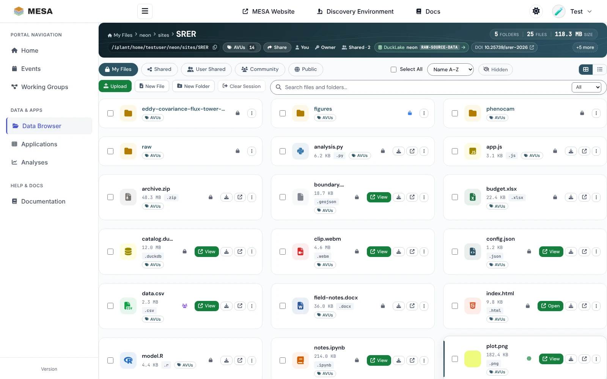
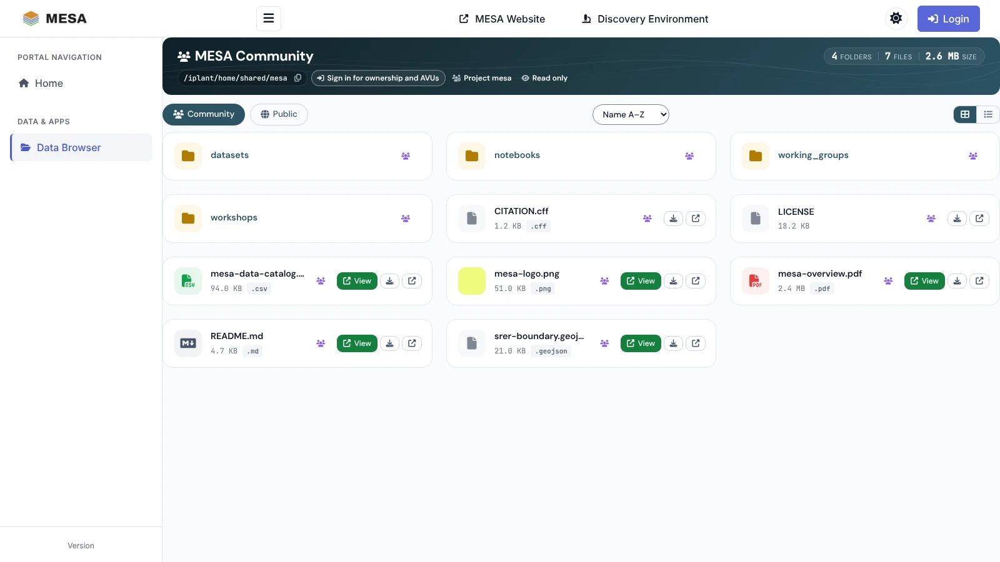
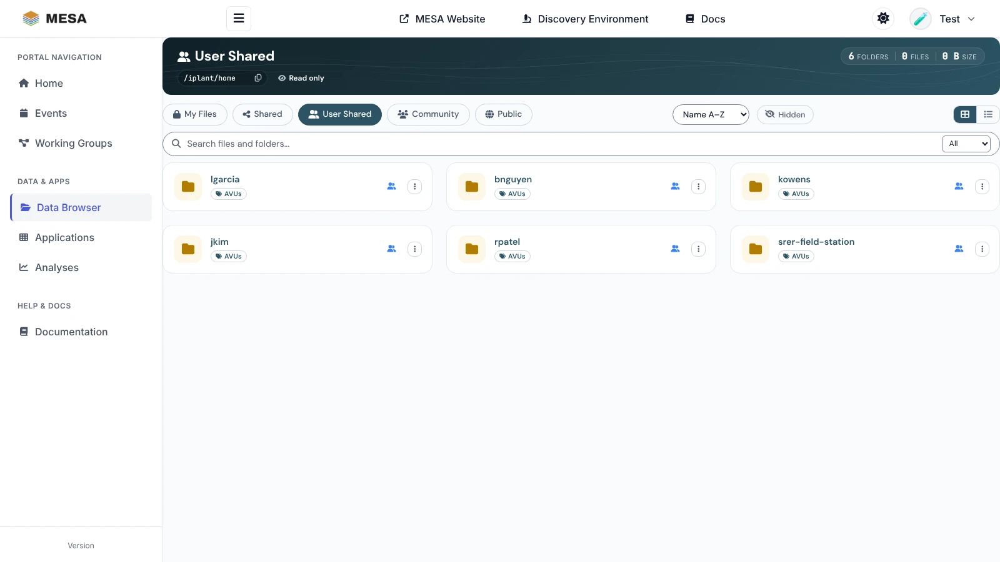
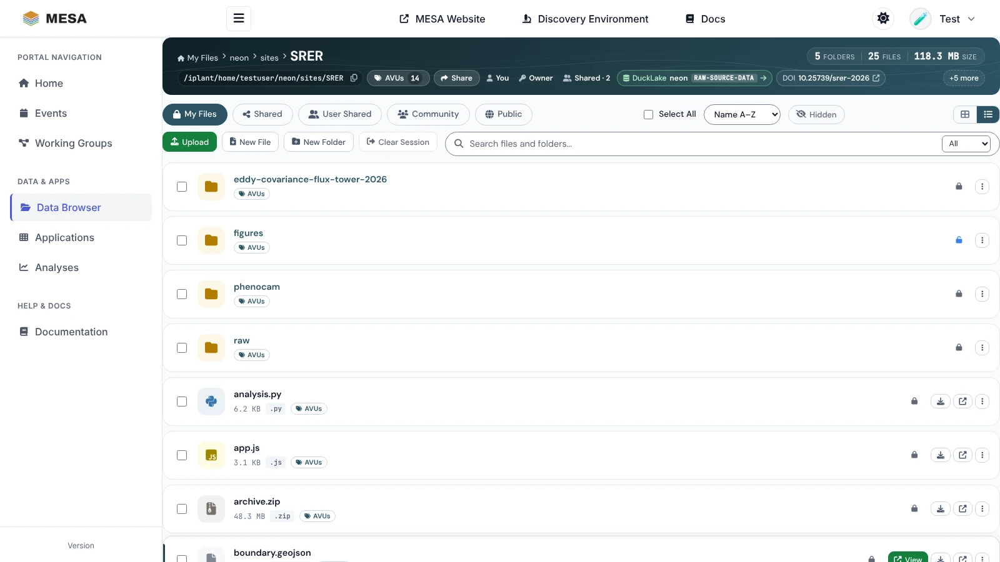
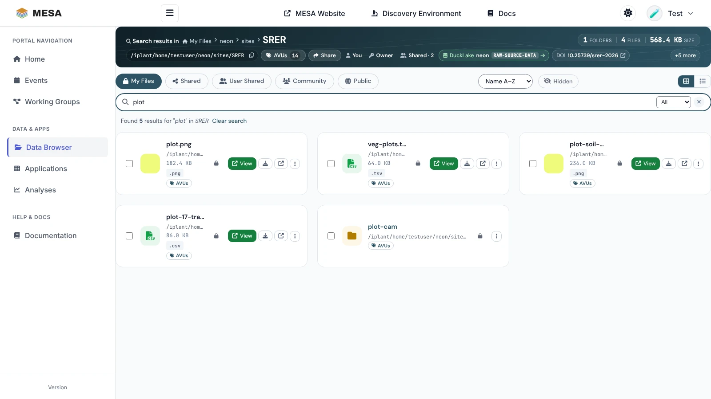
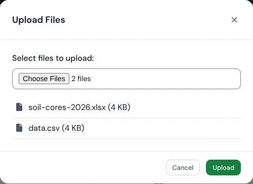
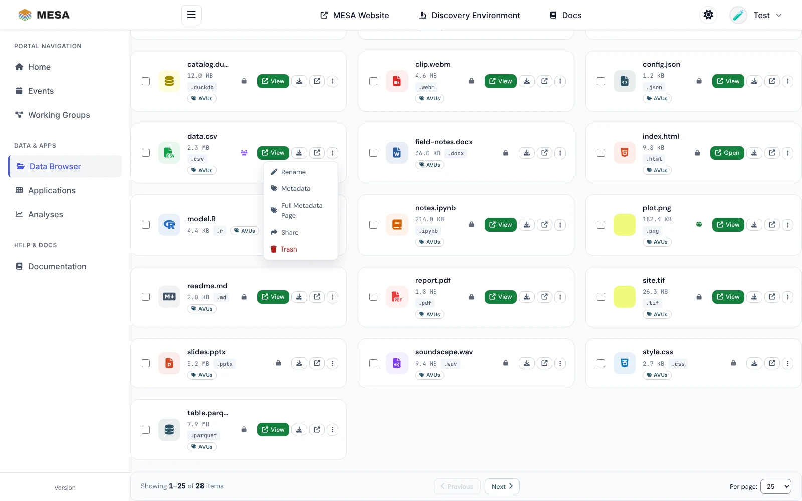
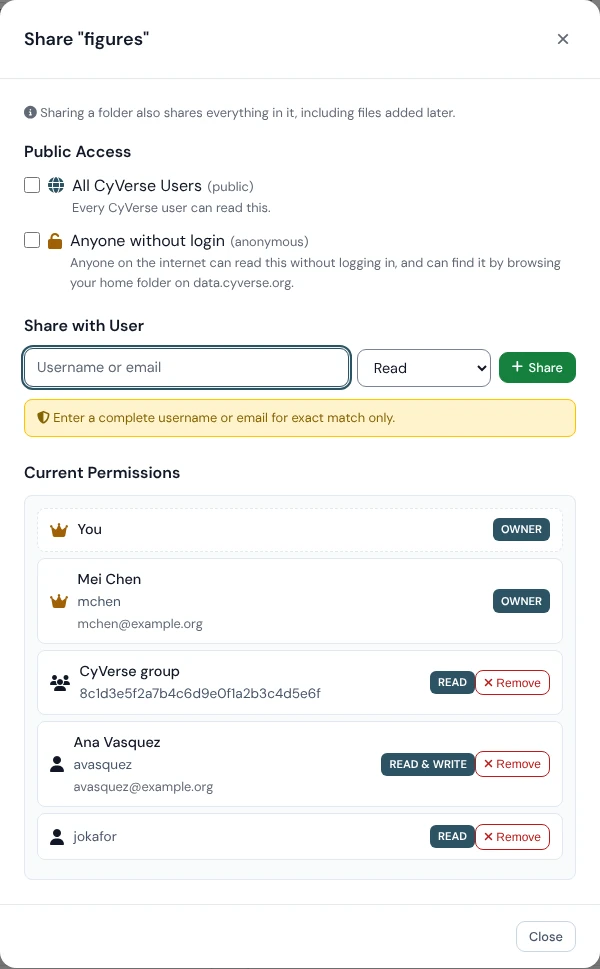
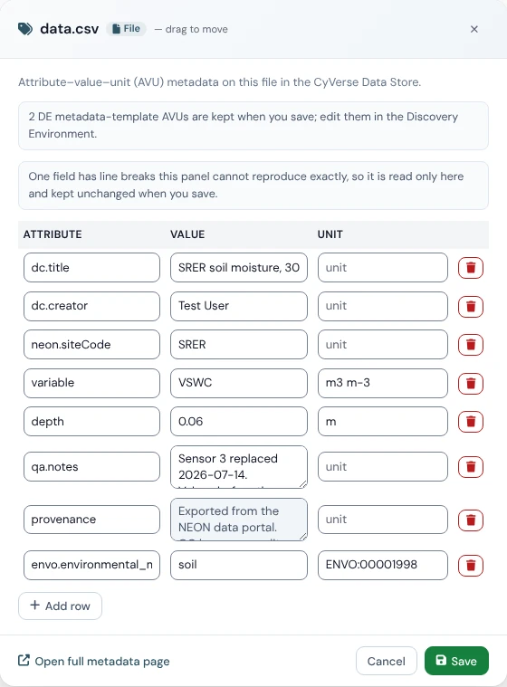

# Managing data

The **Data Browser** (<https://mesa.cyverse.org/data/>) is the portal's window on the
CyVerse Data Store[^portal]. Use it to browse your files and MESA's shared datasets, upload
and organise files, share them with collaborators, and read or edit their metadata.

## Open the Data Browser

Click **Data Browser** in the sidebar. Signed in, it opens your home folder
(`/iplant/home/<your username>`); signed out, it opens the MESA community data.

## Choose where to look

The row of buttons under the header switches between five places:

| View | What it shows | Who sees it |
|---|---|---|
| **My Files** | Your Data Store home folder, `/iplant/home/<username>` | Signed-in users |
| **Shared** | The CyVerse community project tree, `/iplant/home/shared` | Signed-in users |
| **User Shared** | One folder per person who has shared something with you or with a group you belong to | Signed-in users |
| **Community** | The MESA community folder, `/iplant/home/shared/mesa` | Everyone |
| **Public** | Public CyVerse data collections, read only | Everyone |

**User Shared** names people, not folders: open a person to see what they let you open.
It is the same list as *Shared With Me* in the Discovery Environment. The list is
refreshed every few minutes, so something shared a moment ago can take a little while to
appear.

## Read the folder header

The dark band at the top describes the folder you are in:

- **Trail and name**: the path from the view's starting folder. Click any part to jump
  back to it, or drag a file onto a part to move the file there.
- **Counts**: folders, files, and total size.
- **Path**: the full Data Store path, with a copy button. Paste it into iCommands,
  GoCommands, or an AI agent using the [MESA MCP servers](../servers/index.md).
- **AVUs**: the folder's own metadata, with a count (see [Metadata](#describe-data-with-metadata-avus)).
- **Share**: share the folder itself (shown when you own it).
- **Ownership and access**: whose folder it is, your permission (**Owner**, **Can edit**,
  or **Read only**), and how many others can open it (**Shared · N** or **Private**).
- **Relationship chips**, when they apply: **DuckLake** (the folder belongs to a MESA
  DuckLake project), **DOI** (a DOI was minted for it or a parent), DataCite relations
  such as **Part of** or **Derived from**, the **Working group** or **Team** it belongs to,
  and **Analysis output** for folders under your `analyses` folder. **+N more** shows the
  rest.

## Browse and find files

- Click a folder's name to open it. Each file card shows its size, type, and buttons:
  **View** (open it in the built-in viewer), download, and open in a new tab.
- Switch between **cards** and a **list** with the two buttons at the right.
- Sort with the **Name A–Z** menu (name or date, either way).
- **Hidden** shows dot-files; the portal may ask you to sign in again first.
- Large folders are split into pages; use **Next**, **Previous**, and **Per page** at the
  bottom.

### Search

Type in the **Search files and folders** box to find items by name in the folder you are
in and the folders below it. The menu beside the box limits the results to **Files** or
**Folders**. Each result shows its full path; **Clear search** (or **×**) returns to the
folder.

### View files in the browser

**View** opens supported files without downloading them: Jupyter notebooks, R Markdown,
Quarto, and Markdown documents; PDF, HTML, JSON, and YAML; images (JPEG, PNG, GIF, SVG,
WebP, BMP); and more, such as GeoJSON, video, and DuckDB or Parquet tables. A folder of
images can also be opened as a gallery. For anything else, download the file or open it in
the Discovery Environment.

## Upload, create, move, and delete

The action row (signed in, in folders you can write to) has **Upload**, **New File**, and
**New Folder**.

{ width="420" }

- **Upload**: click **Upload** and choose files, or drag files from your computer onto the
  listing. A progress panel tracks each upload.
- **New Folder**: type a name and click **Create**. Avoid spaces; use `-` or `_`.
- **New File**: start a new file from a template, for example a Python script or a
  Markdown note.
- **Rename** and **Trash**: in each card's **⋮** menu. **Trash** moves the item to your
  Data Store trash, from which the Discovery Environment can restore it.
- **Move**: drag a card onto a folder in the trail, or select several items and click
  **Move**.

### Work on several items at once

Tick the box on each card (or **Select All**). A toolbar appears with **Trash**, **Move**,
**Share**, and **Clear**.

## Share data

1. Open the share dialog: **Share** in the folder header for the folder you are in, or
   **Share** in an item's **⋮** menu, or **Share** in the toolbar for several selected
   items.
2. Choose who gets access:
    - **All CyVerse Users (public)**: every signed-in CyVerse user can read it.
    - **Anyone without login (anonymous)**: anyone on the internet can read it.
    - **Share with User**: type a complete CyVerse username or email address, pick
      **Read**, **Write**, or **Own**, and click **Share**.
3. **Current Permissions** lists everyone who has access. Change a level or click
   **Remove** to take access away.

{ width="520" }

Sharing a folder shares everything in it, including files added later. The people you
share with find it under **User Shared**.

## Describe data with metadata (AVUs)

Data Store metadata is stored as **AVUs**, attribute–value–unit triples: for example the
attribute `depth`, the value `0.06`, and the unit `m`.

1. Click the small **AVUs** button under a file or folder's name (or **AVUs** in the folder
   header for the current folder).
2. The panel lists the item's AVUs. If you own the item or can write to it, edit any
   field in place, **Add row** for a new AVU, or use the bin icon to remove one.
3. Click **Save**.

{ width="560" }

Good to know:

- Every AVU needs an attribute and a value; the unit is optional.
- Attribute names starting with `ipc` are reserved by CyVerse.
- AVUs from Discovery Environment metadata templates are kept but not shown; edit those in
  the DE.
- **Open full metadata page** (at the bottom of the panel) shows the schema views
  (DataCite, Dublin Core, EML, Local Contexts, ontology terms) and DOI information.
- AVUs are what the [mesa-mcp](../servers/mesa-mcp.md) server reads and writes, so an AI
  agent can find and curate the same metadata.

## Data in the apps

Interactive apps you start from the portal see your Data Store under `~/data-store`, and
batch analyses write their results under `/iplant/home/<username>/analyses/` unless you
choose another folder. Open **Analysis output** folders here, or use **View Results** on
the [Analyses](analyses.md) page.

## Troubleshooting

| Problem | What to do |
|---|---|
| **My Files** asks for a password | Your CyVerse single sign-on token is missing or expired. Sign out and sign in again with **Sign in with CyVerse**. If you are asked for a WebDAV password, set one in [CyVerse user settings](https://user.cyverse.org); **Clear Session** forgets it. |
| Upload, share, or AVU buttons are missing | You are signed out, or you only have **Read only** access to the folder (see the folder header). |
| A new file does not appear | Wait a few seconds and refresh the page. |
| "Permission denied" | Ask the owner to share the item with you, with **Write** if you need to change it. |
| "Some details unavailable" in the header | Part of the folder information did not load. Click **Retry**. |
| The Data Store does not answer | Check <https://status.cyverse.org> for an outage. |

[^portal]: MESA Portal Data Browser, <https://mesa.cyverse.org/data/>; MESA Portal Data Browser user guide, <https://mesa.cyverse.org/docs/>.
