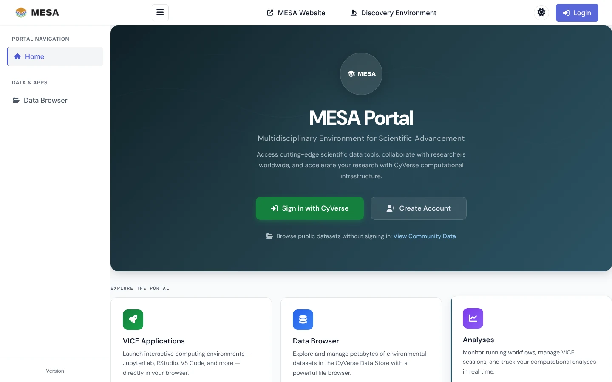
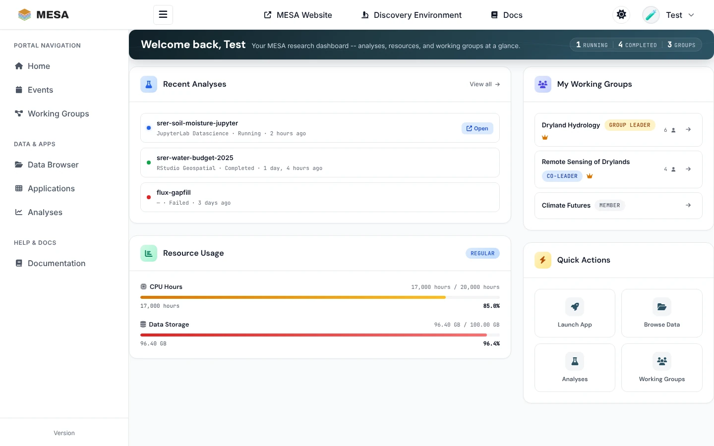

# MESA Portal overview

The **MESA Portal** at **<https://mesa.cyverse.org>** is the web front end of MESA. It
puts your CyVerse Data Store files, the CyVerse Discovery Environment (DE) apps, and your
running analyses on one site, with the MESA [featured apps](../apps/index.md) one click
away[^portal]. You need nothing installed: a browser and a CyVerse account are enough.

Everything you do in the portal acts on your own CyVerse account. Files you upload land in
your Data Store home folder, and analyses you launch appear in the Discovery Environment
too, and the other way round. The portal is an alternative view on the same account, not a
separate copy.

!!! note "About the screenshots"
    The screenshots in this section show the portal with sample data (a user called
    `testuser` and a NEON field-site folder). Your own files, apps, and analyses appear in
    their place.

## Sign in

The portal uses CyVerse single sign-on.

1. Open <https://mesa.cyverse.org>.
2. Click **Sign in with CyVerse** (or **Login** in the top bar).
3. Enter your CyVerse username and password on the CyVerse sign-in page.
4. You return to the portal on your [dashboard](#dashboard).

No CyVerse account yet? Click **Create Account**, or register at
<https://user.cyverse.org>[^cyverse-account]. Registration is free.

On your first sign-in the portal creates your portal profile, links it to your CyVerse
account, and reads your CyVerse team memberships and resource quotas.

### What works without signing in

You can look around before you sign in:

| Page | Signed out | Signed in |
|---|---|---|
| Data Browser | **Community** and **Public** data, read only | Also **My Files**, **Shared**, and **User Shared**, with upload, sharing, and metadata editing |
| Applications (open <https://mesa.cyverse.org/applications/>) | The public **MESA Apps**, **Featured Apps**, and **Browse All Apps** (with search) | Every section, plus launching |
| Analyses | — | Your analyses |

Signed out, the sidebar lists only **Home** and **Data Browser**; the landing page's
**View Community Data** link opens the MESA community folder.

## Find your way around

The **sidebar** on the left groups the pages:

| Section | Pages |
|---|---|
| **Portal navigation** | **Home** (your dashboard), **Events** (workshops and seminars), **Working Groups** (MESA research groups you can join) |
| **Data & Apps** | **Data Browser** — see [Managing data](data.md); **Applications** — see [Starting applications](applications.md); **Analyses** — see [Managing analyses](analyses.md) |
| **Help & Docs** | **Documentation** — the portal's own user guides (signed-in users) |

The **top bar** links to the [MESA website](https://idss-mesa.github.io/), the
[Discovery Environment](https://de.cyverse.org), and these docs, and holds the theme
switch and your user menu (profile, settings, quotas, sign out). On a phone or tablet the
sidebar folds into the ☰ menu button.

## Dashboard

**Home** is your dashboard. It shows, at a glance:

- **Recent Analyses**: your latest analyses with their status. A running interactive app
  has an **Open** link; **View all** goes to the [Analyses](analyses.md) page.
- **Resource Usage**: CPU hours and Data Store space used against your CyVerse quota.
- **My Working Groups**: the MESA working groups you belong to and your role in each.
- **Quick Actions**: shortcuts to launch an app, browse data, check analyses, and open
  working groups.

## Light, dark, or automatic theme

Click the theme button in the top bar to cycle **Light → Dark → Auto**. *Auto* follows
your operating system's setting. You can also choose a theme under **Settings** in the
user menu. Your choice is kept in your browser.

## The portal, the apps, and the MCP stack

MESA offers three ways in to the same CyVerse account:

| Way in | Best for | Start here |
|---|---|---|
| **MESA Portal** (this section) | Browsing and sharing data, launching apps, and watching analyses from a web browser | <https://mesa.cyverse.org> |
| **Featured apps** | Working in JupyterLab, RStudio, VS Code, a terminal, or a full Linux desktop in the cloud, with AI coding agents already set up | [Featured apps](../apps/index.md) |
| **MESA MCP stack** | Driving the Data Store and the Discovery Environment from an AI agent on your own computer | [Quickstart](../quickstart.md) |

## Getting help

- Something in the portal not working? See the troubleshooting notes at the end of
  [Managing data](data.md#troubleshooting), [Starting applications](applications.md#troubleshooting),
  and [Managing analyses](analyses.md#troubleshooting).
- Signed-in users can read the portal's own user guides from **Documentation** in the
  sidebar[^portal-docs].
- CyVerse service status and support: <https://status.cyverse.org> and
  <https://user.cyverse.org/support>.

[^portal]: MESA Portal, <https://mesa.cyverse.org/>.
[^portal-docs]: MESA Portal documentation, <https://mesa.cyverse.org/docs/> (sign-in required).
[^cyverse-account]: CyVerse user portal, <https://user.cyverse.org>.
